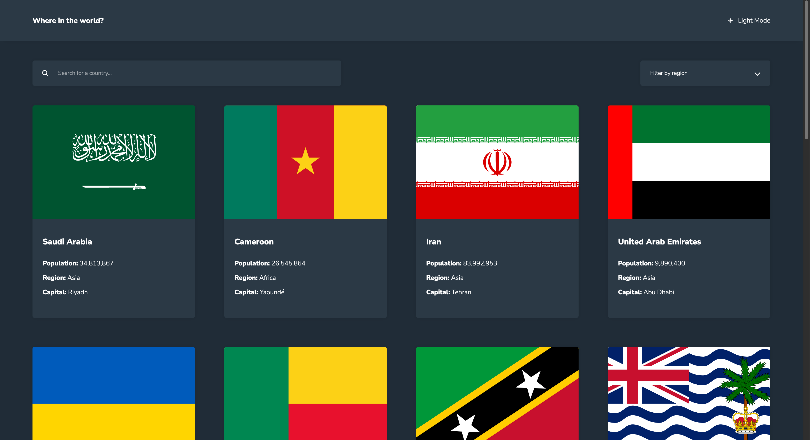

# Frontend Mentor - REST Countries API with color theme switcher solution

This is a solution to the [REST Countries API with color theme switcher challenge on Frontend Mentor](https://www.frontendmentor.io/challenges/rest-countries-api-with-color-theme-switcher-5cacc469fec04111f7b848ca). Frontend Mentor challenges help you improve your coding skills by building realistic projects.

## Table of contents

- [Overview](#overview)
  - [The challenge](#the-challenge)
  - [Screenshot](#screenshot)
  - [Links](#links)
- [My process](#my-process)
  - [Built with](#built-with)
  - [What I learned](#what-i-learned)
  - [Continued development](#continued-development)
  - [Useful resources](#useful-resources)
- [Author](#author)

## Overview

### The challenge

Users should be able to:

- See all countries from the API on the homepage
- Search for a country using an `input` field
- Filter countries by region
- Click on a country to see more detailed information on a separate page
- Click through to the border countries on the detail page
- _IMPLEMENTED / Bonus_ Toggle the color scheme between light and dark mode

### Screenshot

### Links

- Solution URL: [Solution](https://www.frontendmentor.io/solutions/rest-countries-api-app-Uv-wz_Cb6I)
- Live Site URL: [Live site](https://rest-countries-api-app-ai.netlify.app)

## My process

### Built with

- Semantic HTML5 markup
- CSS custom properties
- Flexbox
- CSS Grid
- Mobile-first workflow
- React Context API
- [React](https://reactjs.org/) - JS library
- [ReactRouter](https://reactrouter.com/en/main) - React package for routing
- [ReactHelmetAsync](https://www.npmjs.com/package/react-helmet-async) - React package for editing meta tags programmatically

### What I learned

By building this project I further practiced my React skills and learned more about React Router and React Context API.

### Continued development

I the future I'd like to practice my React skills in general and learn more about React Router and Context API.

### Useful resources

On this [link](https://dev.to/gedalyakrycer/ohsnap-sass-folder-structure-for-react-483e) you can find the folder structure that I used to implement Sass in to this React project.

On this [link](http://getbem.com/) you can learn more about BEM naming convention that I used to name my classes in this project.ewing your solution or for yourself when you look back on this project in the future.\*\*

## Author

- Frontend Mentor - [@andrijaivkovic](https://www.frontendmentor.io/profile/andrijaivkovic)
- Twitter - [@AndrijaIvkovic1](https://twitter.com/AndrijaIvkovic1)
